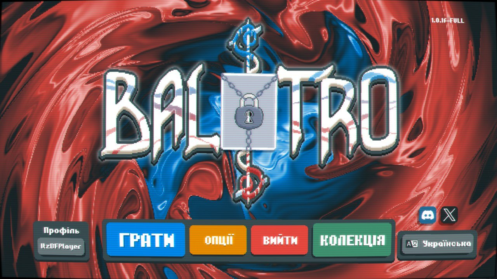
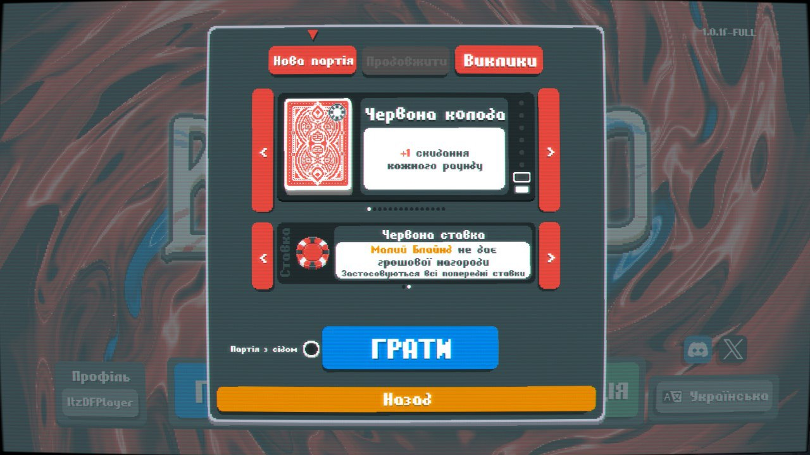
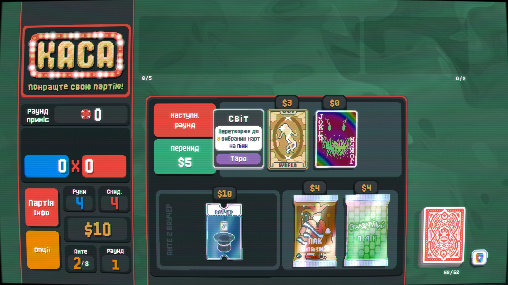

# Українська локалізація для гри Balatro

## Встановлення
1. Завантажити та закинути в папку гри version.dll від сюди https://github.com/ethangreen-dev/lovely-injector/releases/latest
2. Закинути файли архіву в %appdata%/Balatro/

## Скріншоти

## Альтернативний переклад
https://github.com/darksidecat/balatro_ukrainian
